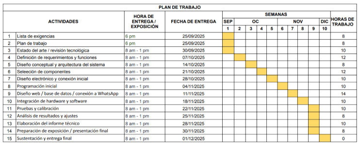

# **1. Lista de Exigencias** 

**Tabla 1: Lista de Exigencias**

|**LISTA DE EXIGENCIAS**|**Páginas: 5**|||
| :-: | :- | :- | :- |
||**Edición: Revisión 1**|||
|**PROYECTO:**|**Sensor de Control de Descomposición en Refrigeradoras de Hogares**|**Fecha: 25/09/2025**||
|||**Revisado:**||
|**CLIENTE:**|**HOGARES CON REFRIGERADORAS**|
**Elaborado:**

**R.S, M.A, M.B, G.S, B.C**
||
|Fecha (cambios)|Deseo o Exigencia|**Descripción**|**Responsable**|
|**25/09/25**|E|**FUNCIÓN PRINCIPAL:** Detectar en tiempo real los productos (frutas y verduras) que estén próximos a descomponerse dentro de las refrigeradoras de los hogares y así emitir una alerta para avisar a la persona.|R.S|
|**25/09/25**|E|**GEOMETRÍA:** El sensor deberá adaptarse físicamente a las refrigeradoras de los hogares sin obstaculizar el almacenamiento. Este no debe superar un tamaño de 15 cm x 15 cm x 10 cm.|M.A|
|**25/09/25**|E|**CINEMÁTICA:** El sistema debe adquirir y procesar información del interior de la refrigeradora de forma continua y con latencia baja, garantizando detección confiable de productos próximos a vencer.|G.S|
|**25/09/25**|E|**FUERZAS**: Durante la instalación del escáner este debe resistir una fuerza manual mayor a 100N. Además, este no debe estar en contacto con los alimentos para evitar transmitir fuerzas que dañen la estructura del escáner.|M.B|
|**25/09/25**|E|
**ENERGÍA (Módulo):** El módulo se alimenta directamente de una fuente de poder como la batería como el Power Bank. 

**EN FUNCIONAMIENTO**: en el momento de uso el consumo de energía es de 0.5W a 2.5 W aproximadamente.

**EN DESCANSO:** Cuando el escáner no está en uso su consumo de energía es nulo o aprox 0.1 W. 
|B.C, R.S, M.A|
|**25/09/25**|E|
**SEÑALES:** Deberá contar con las siguientes señales de entrada y salida:

**Señales de entrada:**

- **Señal de encendido:** Indica que el módulo está energizado y listo. Activa secuencia de comprobación de sensores.

- **Señal de detector de CO2:** Lectura periódica de concentración de CO2 (ppm) que sirve para detectar posible deterioro (Morris, 2006).

- **Señal de fotos:** Imágenes tomadas por la cámara, que sean automatizadas temporalmente (cada 6 horas) y enviadas a un servidor externo (Johnston, 2019). 

**Señales de salida:**

- **Señal de notificaciones remotas:** Mensaje hacia WhatsApp por medio de un bot que brinde evidencia (alertas, reportes, imágenes).
|M.A, M.B, G.S|
|**25/09/25**|E|**CONTROL:** Se implementará un sistema de control automatizado que funcionará en lazo cerrado. La señal de entrada principal será la lectura en tiempo real de un sensor de CO2, que monitoriza los gases liberados durante la descomposición de los productos orgánicos. Estos datos se complementarán con imágenes capturadas periódicamente para proveer contexto visual. Toda la información (datos del sensor y fotos) será transmitida a un servidor externo para su procesamiento. En el servidor, los algoritmos analizarán las lecturas de CO2, contrastándolas con umbrales predefinidos para determinar el estado del producto. Si se detecta una condición de riesgo, el sistema activará su señal de salida: un bot de WhatsApp, previamente configurado por el usuario al vincular su número en una interfaz web, enviará automáticamente un informe de alerta al usuario. Este informe incluirá los niveles de CO2 detectados y las fotografías correspondientes, completando el ciclo de control desde la detección hasta la notificación.|A.S|
|**25/09/25**|E|**ELECTRÓNICA:** El sistema electrónico estará compuesto por un microcontrolador Arduino, seleccionado por su capacidad de procesamiento y conectividad Wi-Fi que se puede integrar. Este actuará como unidad central de procesamiento, interconectándose con un sensor de CO2 (como el MH-Z19B) para la medición de gases de descomposición, y con un módulo de cámara (como el OV2640) para la captura de imágenes. La comunicación con el servidor externo se gestionará directamente mediante el módulo Wi-Fi del ESP32. Todo el sistema será alimentado por una batería de iones de litio con un regulador de voltaje, optimizando la autonomía y portabilidad (Nemade et al., 2024).|B.C, A.S|
|**25/09/25**|E|**SOFTWARE:** El desarrollo del software se dividirá en tres componentes principales. Para el aplicativo móvil o web del usuario se emplearán tecnologías como JavaScript, CSS y HTML, posiblemente con un framework como React o Ionic para la interfaz de usuario. En el servidor externo, se implementarán algoritmos en Python para procesar los datos del sensor de CO2 y las imágenes, aplicando lógica de umbrales y análisis básico. La gestión de la información (historial de lecturas, datos de usuarios, registros de alertas) se almacenará en una base de datos como MySQL o MongoDB. Finalmente, la integración con WhatsApp se realizará mediante APIs específicas (como Twilio o la API de WhatsApp Business) para la automatización del envío de alertas (Nemade et al., 2024).|B.C|
|**25/09/25**|E|**COMUNICACIONES:** El sistema debe garantizar una comunicación confiable, segura y eficiente entre los sensores, el controlador y los sistemas externos (WhatsApp), evitando interferencias y pérdidas de datos.|G.S|
|**25/09/25**|E|
**SEGURIDAD Y MARCO LEGAL:** El funcionamiento de la aplicación se sustenta en un marco legal vigente que avala su propósito de protección al consumidor y reducción del desperdicio de alimentos. Las bases legales principales son:

a) Ley Nº 29571 - Código de Protección y Defensa del Consumidor:

Artículo 5: Derecho a la información. La aplicación garantiza este derecho al proporcionar al usuario información veraz, oportuna y basada en datos científicos (mediante sensores) sobre el estado de frescura real de sus productos orgánicos, superando la limitación de la mera fecha de caducidad.

Artículo 23: Prohibición de comercialización de productos que representen riesgo. Si bien el sistema opera a nivel doméstico, se adhiere al principio de prevención de riesgos para la salud que inspira esta norma. Al alertar al usuario sobre el deterioro del alimento, lo empodera para tomar decisiones informadas que eviten su consumo cuando podría representar un riesgo.

b) Ley Nº 30988 - Ley de reducción y aprovechamiento de pérdidas y desperdicios de alimentos:

Esta ley promueve expresamente programas y tecnologías para la reducción del desperdicio. Nuestra solución se enmarca directamente en este objetivo, ya que actúa como una herramienta tecnológica de prevención que ayuda a los consumidores a optimizar el aprovechamiento de sus alimentos orgánicos, reduciendo las pérdidas en el eslabón final de la cadena: el hogar.
|M.A, M.B|
|**25/09/25**|E|**ERGONOMÍA**: El escáner debe tener un peso ideal, para el cual deberá distribuir   bien, para evitar que el peso se distribuya por un lado u otro, también debería tener un diámetro con medidas exactas para tener un agarre confortable.|G.S|
|**25/09/25**|E|**FABRICACIÓN:** El sensor será desarrollado con materiales accesibles que se encuentran fácilmente en el mercado nacional y componentes electrónicos y sensoriales.|M.A|
|**25/09/25**|E|**MONTAJE**: El sensor deberá diseñarse de manera que pueda instalarse en el interior de diferentes modelos de refrigeradoras domésticas, garantizando compatibilidad con bases niveladas y evitando vibraciones que afecten la lectura del sensor de CO2 o el funcionamiento de la cámara (MET et al., 2016). Además, deberá contar con una batería recargable.|B.C., A.S|
|**25/09/25**|E|**TRANSPORTE:** Los sensores y la cámara deberán tener dimensiones compactas y peso reducido (< 2 kg), lo que facilitará su transporte en cajas de cartón. Deberá resistir movimientos comunes en transporte terrestre y manipulación manual (Wallach & Novikov, 1998).|M.B|
|**25/09/25**|D|**USO:** El sensor deberá funcionar en condiciones variables de temperatura y humedad que se presentan en refrigeradoras domésticas (0–10 °C, humedad relativa 60–90 %). Deberá mantener su precisión de detección de CO2 en concentraciones bajas (50–5000 ppm) y enviar notificaciones mediante conexión inalámbrica (Wi-Fi o Bluetooth) al WhatsApp del usuario (GONG, 2024).|A.S|
|**25/09/25**|E|
**MANTENIMIENTO:**

- Componentes mecánicos y electrónicos: Acceso sencillo para inspección, limpieza de la cámara y verificación de conexiones.

- Sensores de CO2: Deberán calibrarse o reemplazarse tras un periodo estimado de 3 años, según la vida útil reportada por el fabricante (Eickhoff & Wood, 2007).
|G.S|
|**25/09/25**|E|**COSTOS:** El costo estimado del prototipo del sistema de monitoreo con sensor de CO2 y cámara se encuentra en un rango de US $150 a US $220 por unidad (aproximadamente S/ 550 a S/ 820, según el tipo de cambio y los aranceles de importación). A estos valores se suman costos de integración, pruebas y mano de obra (~US $30-50).|B.C|
|**25/09/25**|E|**PLAZOS:** El proyecto empezará el jueves 25 de septiembre y espera su finalización el lunes 1 de diciembre a las 8 a.m. con un total aproximado de 130 horas de trabajo.|M.A|
#

# **2. Plan de Trabajo**

**Figura 1: Plan de Trabajo**
#
# 

#
# **Bibliografía**

Eickhoff, S. J., & Wood, R. A. (2007). *Calibration device for carbon dioxide sensor* (United States Patent No. US7174766B2). https://patents.google.com/patent/US7174766B2/en

GONG, C. (2024). *Food freshness detecting device and methods for using the same* (United States Patent No. US20240044861A1). https://patents.google.com/patent/US20240044861A1/en

Johnston, S. K. (2019). *Scent-based spoilage sensing refrigerator* (United States Patent No. US20190311598A1). https://patents.google.com/patent/US20190311598A1/en?oq=US+20190311598A1

MET, A., Celik, A., SOYSAL, F. A., AKINCI, I., Arisoy, E., & Kaya, M. (2016). *A refrigerator comprising a sensor that detects spoilage of food* (World Intellectual Property Organization Patent No. WO2016087084A1). https://patents.google.com/patent/WO2016087084A1/en

Morris, R. (2006). *Food freshness sensor* (United States Patent No. US20060121165A1). https://patents.google.com/patent/US20060121165A1/en

Nemade, B., Shah, K., Marakarkandy, B., & Nagra, R. K. (2024). International Journal of INTELLIGENT SYSTEMS AND APPLICATIONS IN ENGINEERING An efficient IoT-Based. . . *ResearchGate*. https://www.researchgate.net/publication/378313726_International_Journal_of_INTELLIGENT_SYSTEMS_AND_APPLICATIONS_IN_ENGINEERING_An_Efficient_IoT-Based_Automated_Food_Waste_Management_System_with_Food_Spoilage_Detection

Wallach, D. F. H., & Novikov, A. (1998). *Methods and devices for detecting spoilage in food products* (World Intellectual Property Organization Patent No. WO1998020337A1). https://patents.google.com/patent/WO1998020337A1/en

Pág. 2
